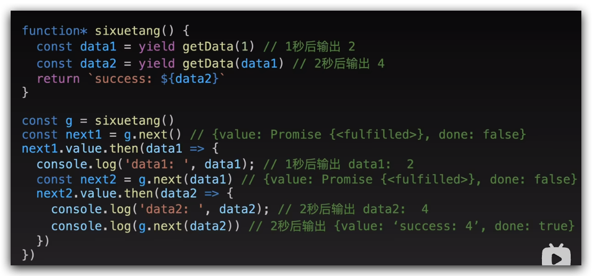
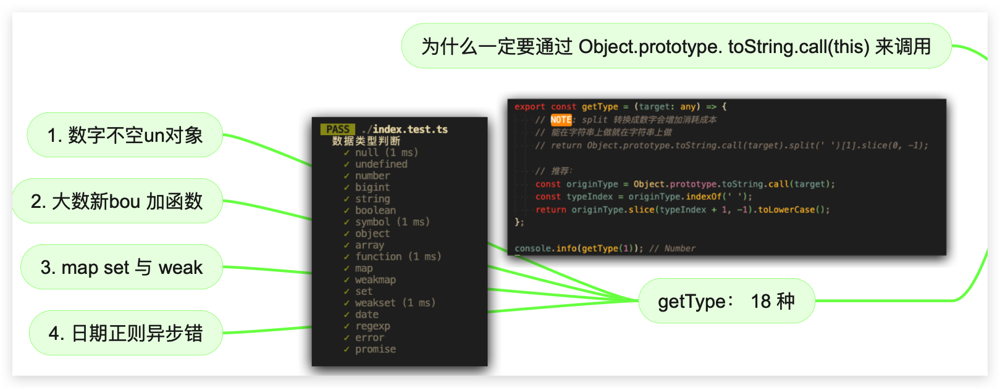
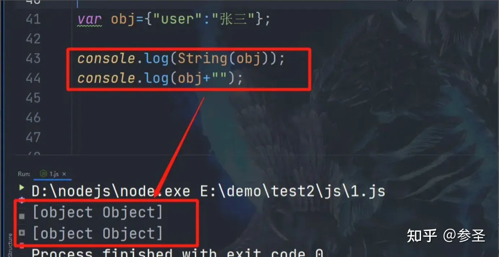

# 海纳百川 —— 基础篇

## 目录

- [1. HTML + CSS](#1-HTML--CSS)
  - [CSS的多列布局](#CSS的多列布局)
  - [css calc属性的作用是什么，主要用于解决什么问题](#css-calc属性的作用是什么主要用于解决什么问题)
  - [iframe有哪些优点？有哪些缺点？用来解决什么问题？](#iframe有哪些优点有哪些缺点用来解决什么问题)
  - [🎹Google Chrome 如何支持大小小于12px的字体](#Google-Chrome-如何支持大小小于12px的字体)
  - [🎹HTML5 的特性有哪些？](#HTML5-的特性有哪些)
  - [🎹CSS3 的特性有哪些？](#CSS3-的特性有哪些)
  - [如何清除浮动？](#如何清除浮动)
  - [🎹伪类选择器和伪元素选择器的区别](#伪类选择器和伪元素选择器的区别)
  - [🎹HTML5的 input元素 type 属性有多少种？](#HTML5的-input元素-type-属性有多少种)
  - [🎹CSS中哪些属性可继承，哪些不可以？](#CSS中哪些属性可继承哪些不可以)
  - [🎹如何使用CSS画一条0.5px的线？](#如何使用CSS画一条05px的线)
  - [🎹隐藏一个元素有哪些方法？display: none 与 visibility: hidden 与 opacity:0之间的区别？](#隐藏一个元素有哪些方法display-none-与-visibility-hidden-与-opacity0之间的区别)
  - [🎹position 的值有哪些，分别有什么特点？](#position-的值有哪些分别有什么特点)
  - [🎹什么是浮动，浮动会引起什么问题，有何解决方案？？？？？？](#什么是浮动浮动会引起什么问题有何解决方案)
  - [🎹line-height 和 height 的区别?](#line-height-和-height-的区别)
  - [🎹设置一个元素的背景颜色，背景颜色会填充哪些区域？](#设置一个元素的背景颜色背景颜色会填充哪些区域)
  - [🎹inline-block、inline 和block 的区别；为什么img是 inline 还可以设置宽高?](#inline-blockinline-和block-的区别为什么img是-inline-还可以设置宽高)
  - [🎹什么是重绘？什么是回流？如何减少？如何让文档脱离文档流？](#什么是重绘什么是回流如何减少如何让文档脱离文档流)
  - [🎹css 动画如何实现](#css-动画如何实现)
  - [🎹如何实现在某个容器中居中的？](#如何实现在某个容器中居中的)
  - [🎹如何改变一个 DOM 元素的字体颜色？](#如何改变一个-DOM-元素的字体颜色)
  - [🎹less 和 scss 有什么区别？](#less-和-scss-有什么区别)
  - [🎹响应式布局实现方案？](#响应式布局实现方案)
  - [🎹link 标签和 import 标签的区别？](#link-标签和-import-标签的区别)
  - [🎹说一下块元素、行元素、置换元素](#说一下块元素行元素置换元素)
  - [🎹多行元素的文本省略号如何实现？](#多行元素的文本省略号如何实现)
- [2. JavaScript](#2-JavaScript)
  - [await 是如何实现同步的？](#await-是如何实现同步的)
  - [将一个16进制数据转成10进制](#将一个16进制数据转成10进制)
  - [this指向问题](#this指向问题)
  - [什么时候不能使用箭头函数](#什么时候不能使用箭头函数)
  - [如何判断JavaScript中的数据类型？](#如何判断JavaScript中的数据类型)
  - [javascript 的数据类型有哪些？](#javascript-的数据类型有哪些)
  - [toString 与 valueOf](#toString-与-valueOf)
  - [如何理解Symbol](#如何理解Symbol)
  - [如何判断对象为空](#如何判断对象为空)
  - [如何实现数组的随机排序？](#如何实现数组的随机排序)
  - [Reflect](#Reflect)
- [3. 浏览器](#3-浏览器)
  - [标签页通信](#标签页通信)

# 1. HTML + CSS

## CSS的多列布局

先简单理解，后续补充。主要涉及到的属性就是

- column-count
- column-gap
- column-

## css calc属性的作用是什么，主要用于解决什么问题

calc属性在CSS中作用是执行动态计算，主要解决了在进行数学计算时的问题，使得CSS样式更具有灵活性和适应性。

也可以用于实现一些响应式布局

## iframe有哪些优点？有哪些缺点？用来解决什么问题？

HTML iframe的优点包括**内容嵌入、页面代码分离、模块化设计**。具体如下：

1. **内容嵌入**：iframe能够将外部网页或文档嵌入到当前页面中，以窗口形式呈现，这对于集成第三方资源如广告、视频或音频等尤为有用。
2. **页面代码分离**：通过使用iframe可以将静态页面方便地调入，实现页面内容与程序逻辑的分离，便于维护和更新。
3. **模块化设计**：利用iframe可以实现模块化的设计，例如多个网页引用同一个iframe时，只需更新iframe的内容，即可实现所有引用页面的同步更新。

HTML iframe的缺点包括**性能影响、SEO不友好、导航混乱、样式和脚本问题**。具体如下：

1. **性能影响**：iframe会增加服务器的HTTP请求，**可能会阻塞父页面的onload事件**，且与主页面共享连接池，这影响了页面的并行加载效率。
2. **SEO不友好**：搜索引擎可能难以解析iframe内容，因此过多使用iframe可能不利于网站的搜索引擎优化（SEO）。
3. **导航混乱**：在框架结构中可能会出现多余的滚动条，造成用户界面混乱，并分散用户注意力。
4. **样式和脚本问题**：由于样式和脚本需要额外链入，这不仅增加了请求的数量，还可能导致与其他脚本的冲突。

HTML iframe主要用于解决以下问题：

1. **隔离不同内容**：通过iframe，可以隔离不同源的内容，避免全局CSS或JavaScript的影响，常用于所见即所得的网页编辑器中。
2. **嵌入第三方内容**：比如地图、视频或广告，使得网站能展示更加丰富的功能而不必自己开发这些功能。
3. **改善用户体验**：例如在Websocket不可用时使用iframe实现长连接，或在HTML5 History API不可用时提供前进后退按钮的支持。

项目中曾经用来嵌入第三方的开源软件 redash。Redash是一个**开源的数据可视化和分析平台**，支持连接多种数据源，用户可以在一个平台上查询和分析来自不同数据源的数据。

redash还可以做到**数据可视化**，用户可以利用查询结果创建各种图表和仪表板，从而更加直观地展示数据分析的结果

## 🎹Google Chrome 如何支持大小小于12px的字体

Google Chrome浏览器支持小于12px字体的方法可能有以下几种：

1. CSS zoom 属性设置为0.8
2. CSS transform属性设置为scale(0.8)

## 🎹HTML5 的特性有哪些？

1. **语义化标签**：HTML5引入了如`<header>`、`<footer>`、`<nav>`、`<article>`、`<section>`等新的语义化标签，这些标签提升了页面的结构性，有助于SEO，并且对屏幕阅读器用户更加友好。
2. **增强型表单**：HTML5提供了新的表单控件，例如数字、日期、时间、日历和滑块，这些控件使得用户可以更方便地输入和选择信息。
3. **绘图功能**：HTML5通过`<canvas>`元素提供了强大的绘图功能，允许开发者在网页上绘制复杂的图形和动画。
4. **多媒体支持**：HTML5支持原生的视频和音频播放，不再需要额外的插件，这极大地简化了多媒体内容的嵌入和播放。
5. **地理位置信息**：HTML5允许网站通过Geolocation API获取用户的地理位置信息，这对于位置相关的服务和应用非常有用。
6. **本地存储**：HTML5支持本地存储，包括sessionStorage和localStorage，这使得网页可以在用户本地存储数据，而不必依赖于cookies。
7. **多线程支持**：HTML5通过Web Workers提供了多线程的支持，允许在后台运行脚本而不干扰页面的性能。
8. **拖拽API**：HTML5提供了拖拽API，使得实现元素的拖放功能变得更加简单。
9. **WebSocket**：HTML5引入了WebSocket API，允许建立持久的连接，实现服务器与客户端之间的双向通信。
10. **新的文档类型和字符集**：HTML5简化了文档类型声明，并且默认使用UTF-8字符编码，这有助于提高网页的国际兼容性。

## 🎹CSS3 的特性有哪些？

CSS3作为最新的CSS标准，它不仅向后兼容之前的CSS1和CSS2，还引入了许多新特性来增强Web页面的表现力和用户体验。以下是CSS3的一些主要特性：

- **选择器**：CSS3引入了更多强大的选择器，如子选择器、相邻兄弟选择器、通用兄弟选择器和群组选择器，以及属性选择器，它们提供了更精确的元素选取方式。
- **边框与圆角**：新增的边框属性如`border-radius`用于创建圆角边框，`box-shadow`用于为元素添加阴影，`border-image`则可以使用图片来绘制边框。
- **背景与渐变**：CSS3允许使用背景渐变，这使得背景设计更加丰富和多样化。
- **过渡**：CSS3过渡可以让元素的状态变化更加平滑，例如鼠标悬停效果或者焦点变化时的样式过渡。
- **变换**：通过`transform`属性，可以实现元素的旋转、缩放、倾斜等变换效果，增加了页面的动态感。
- **动画**：CSS3动画允许开发者创建复杂的关键帧动画，从而在不使用JavaScript的情况下实现动态效果。
- **布局**：CSS3新增了多种布局特性，如弹性布局（flexbox）、网格布局（grid）和多列布局（multicolumn），这些布局模型提供了更灵活的方式来控制页面布局和元素定位。

## 如何清除浮动？

1. **使用clear属性**：给需要清除浮动的元素添加`clear: both;`样式，可以清除该元素之前的所有浮动元素

在浮动元素的最后再添加一个元素，然后设置clear：both属性

1. 使用伪元素：
2. **使用BFC（块级格式化上下文）**：将需要清除浮动的元素的父元素设置为BFC，可以使其内部的浮动元素不会影响到外部布局。比如将父元素设置属性 overflow：hidden。或者设置flex布局

## 🎹伪类选择器和伪元素选择器的区别

**伪类选择器和伪元素选择器在CSS中有着明确的区别，主要体现在它们的功能和使用方式上**。

**从功能角度来看，伪类选择器主要用于选择那些处于特定状态的元素**，例如被点击的链接（`:active`），被悬停的元素（`:hover`），或者是首次出现的元素（`:first-child`）。它们并不创造新的元素，而是对现有元素在特定状态下的样式进行修改。

**伪元素选择器则用于创建新的内容或效果，这些内容在文档结构中并不存在**，例如可以在元素前后插入内容（`::before` 和 `::after`），或者可以改变第一行的样式（`::first-line`），还可以对元素的首行的第一个字母进行特殊样式处理（`::first-letter`）。

其次，**在使用方式上，****伪类选择器在CSS2及之前的版本中使用单冒号（****`:`****）表示，而伪元素选择器在CSS3中规定使用双冒号（****`::`）表示**。这样的规定有助于区分两者，尽管在一些旧版本的浏览器中单冒号也可以用来表示伪元素。另外，伪元素选择器在一个选择器中只能出现一次，并且必须出现在末尾，而伪类选择器没有这样的限制。

## 🎹HTML5的 input元素 type 属性有多少种？

HTML5 的 `<input>` 元素支持多种 `type` 属性值，用以定义不同类型的输入控件。

以下是一些常见的 `<input>` 类型：

1. **文本框** (`type="text"`): 用于输入单行文本，常用于填写姓名、电子邮件地址等。
2. **密码框** (`type="password"`): 用于输入密码，内容以点或星号显示，以隐藏输入的信息。
3. **复选框** (`type="checkbox"`): 允许用户从多个选项中选择一项或多项。
4. **单选按钮** (`type="radio"`): 通常用于提供一组互斥的选项中选择一个。
5. **隐藏值** (`type="hidden"`): 用于存储表单中不需要用户看到的数据。
6. **文件上传** (`type="file"`): 让用户能够选择本地计算机上的文件并上传。
7. **提交按钮** (`type="submit"`): 将表单数据发送到服务器。
8. **重置按钮** (`type="reset"`): 清除表单中的所有输入字段。
9. **按钮** (`type="button"`): 可自定义的通用按钮，通常与 JavaScript 一起使用。
10. **图片提交** (`type="image"`): 显示图像作为提交按钮，点击图像的某部分会提交表单。

## 🎹CSS中哪些属性可继承，哪些不可以？

**CSS中可继承的属性包括字体系列属性、文本系列属性以及元素可见性和光标属性等**，而**不可继承的属性包括display、文本属性、盒子模型的属性、背景属性和定位属性等**。

在CSS中，有一些属性是默认可以继承的。这些属性通常会影响元素的文本内容或基本显示特征。具体介绍如下：

- **字体系列属性**: 包括`font`、`font-family`、`font-weight`、`font-size`、`font-style`，这些属性影响文本字符的展示。
- **文本系列属性**: 对于内联元素来说，有`color`、`line-height`、`word-spacing`、`letter-spacing`、`text-transform`；而对于块级元素，则有`text-indent`和`text-align`。
- **元素可见性**: `visibility`属性决定了元素是否可见。
- **光标属性**: `cursor`用来定义鼠标指针在元素上方时的样式。

相对于可继承的属性，CSS中同样有许多属性是不被继承的，它们需要为每个元素单独指定。详细介绍如下：

- **display**: 规定元素生成的框的类型，如`block`、`inline`等。
- **文本属性**: 包括`vertical-align`（垂直对齐）、`text-decoration`（文本装饰）、`text-shadow`（文本阴影）和`white-space`（空白符处理）等。
- **盒子模型的属性**: 如`width`、`height`、`margin`、`border`、`padding`等，它们定义了元素盒模型的特征。
- **背景属性**: 诸如`background-color`和`background-image`，用于设置元素的背景。
- **定位属性**: 包括`float`、`clear`、`position`及其相关的`top`、`right`、`bottom`、`left`，以及`min-width`、`min-height`、`max-width`、`max-height`、`overflow`和`clip`等。

了解哪些CSS属性是可继承的，可以帮助开发者更高效地编写代码，避免不必要的重复声明，从而提高样式表的维护性。同时，意识到不可继承的属性则有助于精确控制页面元素的样式表现。

## 🎹如何使用CSS画一条0.5px的线？

在CSS中，可以使用伪元素（：:before或：:after）和transform属性来绘制一条0.5px的线。以下是一个示例代码：

宽度设置为100%，height属性设置为1px。之后使用`transform：scaleY（0.5）`

## 🎹隐藏一个元素有哪些方法？display: none 与 visibility: hidden 与 opacity:0之间的区别？

隐藏一个元素的方法有：**设置visibility为hidden、opacity为0、display为none，以及使用position属性定位到不可见区域等**。具体如下：

1. **visibility: hidden**：该属性仅隐藏元素内容，但保留其所占用的空间。绑定在其上的事件处理器依然可以被触发。
2. **opacity: 0**：将透明度设置为0，使元素完全透明，类似于visibility: hidden，但它仍然占据空间。可以响应事件
3. **display: none**：此方法会彻底隐藏元素，并且不占据任何空间，也不会响应事件。
4. **position: absolute**：通过将元素的left和top属性设定到屏幕外的数值来隐藏它。

## 🎹position 的值有哪些，分别有什么特点？

CSS中的position属性用于控制元素的定位方式，它有多个值，每个值都有其独特的特点和适用场景。具体如下：

1. **static**：这是position属性的默认值。元素按照正常的文档流进行布局，忽略left、top、right、bottom或者z-index等定位相关的声明。
2. **relative**：相对定位，元素相对于其在正常文档流中的位置进行偏移。即使元素移动了位置，它仍然保留在文档流中的空间，不会影响其他元素的位置。
3. **absolute**：绝对定位，元素相对于最近的非static定位的祖先元素进行定位。如果不存在这样的元素，则相对于初始包含块。元素完全脱离正常文档流，不占据空间。
4. **fixed**：固定定位，元素相对于浏览器窗口进行定位，即使页面滚动，元素也会停留在设定的位置。与absolute类似，元素脱离文档流。
5. **sticky**：粘性定位，是CSS3中新增的定位方式。它结合了relative和fixed的特点，当元素在视口内时表现如同relative定位，当滚动到一定位置时，它会变成fixed定位。
6. **inherit**：继承定位，元素会继承其父元素的position属性值。

relative 如果没有就近的postion为非static的元素，是参照哪里进行的偏移？

## 🎹什么是浮动，浮动会引起什么问题，有何解决方案？？？？？？

浮动就是让一个元素脱离原本的文档流，从原本的文档流中浮起来的属性。有着文本环绕、令父元素高度塌陷的特性。

1. **清除浮动（Clearfix）**：通过在浮动元素后面添加一个清除浮动的元素，或者使用伪元素清除浮动，可以解决布局错乱的问题。例如，使用`clear: both;`属性可以确保元素在视觉上位于所有浮动元素之后。
2. **BFC（Block Formatting Context）**：通过创建一个块格式化上下文，可以防止浮动影响其他区域。可以通过给容器设置`overflow: auto;`、`display: table;`或者`display: flow-root;`来创建一个新的BFC。
3. **Flexbox**：弹性盒子布局（Flexbox）提供了更简单的方式来控制元素的布局，它可以很容易地处理浮动引起的问题，并且更加灵活和强大。
4. **Grid Layout（网格布局）**：CSS网格布局是一个二维的布局系统，它能够处理复杂的布局需求，包括浮动引起的问题。
5. **使用现代布局技术**：如CSS Flexbox和CSS Grid，这些技术提供了更好的布局控制，减少了对浮动的依赖。
6. **显式设置容器的高度**：对于塌陷容器问题，可以通过显式设置容器的高度来保证其具有足够的高度，以包含浮动的子元素。

## 🎹line-height 和 height 的区别?

在CSS中，`line-height` 和 `height` 都是用来控制元素高度的属性，但它们控制的层面有所不同。

1. **作用**：`line-height` 主要用来控制文本行与行之间的距离，即两行文字的基线之间的垂直距离。而 `height` 是用于指定一个元素的整体高度。
2. **影响范围**：`line-height` 影响的是元素的内联内容，特别是文本。即使元素没有设置 `height` 属性，通过调整 `line-height` 也可以改变行框的高度，进而影响文本的垂直居中显示。相反，`height` 定义了元素自身的高度，它决定了元素所能包含内容的空间大小。
3. **表现效果**：当为元素设置 `line-height` 时，它会均分给每一行文本，如果文本行数超过 `height` 所定义的范围，那么超出的部分可能会被隐藏或导致滚动条出现。而设置 `height` 则直接限制了元素的整体高度，无论内部文本如何变化。
4. **默认值**：`line-height` 的默认值通常是“normal”，它取决于字体的大小和家族。对于大多数浏览器而言，这通常等于字体大小的1.0到1.2倍。而 `height` 的默认值依赖于元素的 display 属性，例如对于 inline 元素，其 height 是由内容决定的，而对于 block 元素，如果没有显式设置 height，那么它将由其内容决定，并且会尽可能地小。

## 🎹设置一个元素的背景颜色，背景颜色会填充哪些区域？

设置元素的背景颜色时，背景颜色会填充**内容区域、内边距和边框区域**。具体如下：

1. **内容区域（Content Area）**：这是元素实际内容所在的区域，不包括任何额外的空间或装饰。
2. **内边距（Padding Area）**：内边距是围绕内容区域的空白区域，可以通过CSS的`padding`属性来设置。
3. **边框区域（Border Area）**：边框是包围内边距和内容的线或者样式化的边缘，可以通过CSS的`border`属性来定义。

此外，如果设置了边框为透明或具有透明部分（如虚线边框），背景颜色也会透过这些透明部分显示出来。

总的来说，背景颜色通常不会填充外边距（Margin），外边距是元素周围的空间，用于与其他元素分隔开来。

## 🎹inline-block、inline 和block 的区别；为什么img是 inline 还可以设置宽高?

**`inline-block`****、****`inline`**\*\* 和 ****`block`****是 CSS 中用来定义元素显示类型的属性值。它们各自有着不同的特性和表现行为 \*\*。具体如下：

1. **Block**：块级元素会独占一行，可以设置宽度和高度，并且水平垂直方向的margin和padding都有效。块级元素在页面中通常表现为独立的一块，每个块级元素前后都会有换行。
2. **Inline**：内联元素不会独占一行，它们从左到右排列，只有当该行排满时才会换到下一行。内联元素的宽度和高度不能直接设置，它们的尺寸由内容决定。对于内联元素来说，只能设置水平方向的margin和padding，而垂直方向的margin和padding则不生效。
3. **Inline-block**：内联块级元素结合了内联元素和块级元素的特性。它像内联元素一样和其他内联元素排列在同一行内，但又可以像块级元素一样设置宽度和高度。这使得内联块级元素在保持内联特性的同时，又拥有了一定的布局能力。此外，内联块级元素之间通常会有间隙。

至于为什么`img`元素虽然是内联元素却可以设置宽度和高度，这是因为图像本身具有固有比例。在HTML中，`img`元素默认是内联元素，但它有一些特殊的属性，允许用户通过`width`和`height`属性来改变图像的显示尺寸。这并不违反内联元素不能设置宽高的规则，因为图像内容的固有比例仍然被保留。换句话说，即使改变了`img`标签的宽度或高度，浏览器也会保持图像的长宽比不变，只是在视觉上进行了缩放。

总的来说，`block`、`inline`和`inline-block`各有其用途和限制，而`img`元素虽然属于内联元素，但由于其特殊性，可以设置宽度和高度以调整显示大小。

## 🎹什么是重绘？什么是回流？如何减少？如何让文档脱离文档流？

**重绘是指当元素的外观发生改变，但没有改变布局时重新绘制部分或全部页面的过程。**

**而回流是当DOM的变化影响了元素的几何属性（宽或高），浏览器重新计算元素的几何属性，影响了其他元素的布局，并重新构造渲染树的过程**。

减少回流的方式：

1. CSS层面：使用class的方式批量修改样式；动画使用CSS3进行设置，会启用GPU加速。transform 属性
2. HTML层面：使用createDocumentFragment 添加DOM；使用BFC特性，不影响其他元素；修改前使用display：none脱离文档流
3. JavaScript层面：防抖、截流；使用requestAnimationFrame优化动画

## 🎹css 动画如何实现

使用 @keyframe设置关键帧动画，并为这个动画取一个名字。关键帧就是 百分之几，然后对应一些花括号包裹的样式属性

在指定的元素上通过 animation-name 属性应用动画，并通过一系列animation属性设置动画的过渡。

比如过渡时间 ：animition-duration；是否循环等

```html
<!DOCTYPE html>
<html>
<head>
<style>
/* 定义动画 */
@keyframes example {
  0%   {background-color: red; left: 0px; top: 0px;}
  25%  {background-color: yellow; left: 200px; top: 0px;}
  50%  {background-color: blue; left: 200px; top: 200px;}
  75%  {background-color: green; left: 0px; top: 200px;}
  100% {background-color: red; left: 0px; top: 0px;}
}

/* 应用动画 */
div {
  width: 100px;
  height: 100px;
  position: relative;
  background-color: red;
  animation-name: example;
  animation-duration: 4s;
  animation-iteration-count: infinite;
}
</style>
</head>
<body>

<h1>CSS动画示例</h1>
<div></div>

</body>
</html>
```

## 🎹如何实现在某个容器中居中的？

flex布局：justify-content以及align-items属性设置成center；

position：top left 设置为50%，然后再加上偏移

偏移方式有：transform translate；margin 设置负值；

## 🎹如何改变一个 DOM 元素的字体颜色？

1. 获取一个DOM对象，设置style.color&#x20;
2. className属性，添加类名
3. 使用setAttribute方法

## 🎹less 和 scss 有什么区别？

Sass的功能比Less强大,基本可以说是一种真正的编程语言了.

Less则相对清晰明了,易于上手,对编译环境要求比较宽松。

Less与Sass处理机制不一样，前者是通过客户端处理的，后者是通过服务端处理，相比较之下前者解析js会比后者慢一点。

引入：SCSS的常见语法

## 🎹响应式布局实现方案？

1. 媒体查询
2. rem布局
3. 百分比单位、calc计算
4. 弹性盒子，grid布局

引入：flex grid 布局

## 🎹link 标签和 import 标签的区别？

`link`标签和`@import`标签都可以用于引入外部CSS样式表，但它们之间存在一些关键的区别。

首先，从**从属关系**上来看，`link`是HTML的标签，不仅可以加载CSS文件，还可以定义RSS、rel连接属性等；而`@import`是CSS的语法，主要用于导入外部样式表。

其次，在**加载顺序**上，`link`标签引入的CSS会与HTML同时被加载；而`@import`引入的CSS会在页面加载完毕后才加载。

此外，从**浏览器兼容性**角度来看，`link`标签作为HTML标签，没有兼容性问题；而`@import`是在CSS2.1中提出的，低版本的浏览器可能不支持。

最后，关于**权重和使用场景**，`link`方式的样式权重高于`@import`的权重，且`link`支持使用JavaScript改变样式，而`@import`不支持。

```html
<!DOCTYPE html>
<html lang="en">
<head>
  <meta charset="UTF-8">
  <meta name="viewport" content="width=device-width, initial-scale=1.0">
  <title>Document</title>
  <link id="stylesheet" rel="stylesheet" href="styles1.css">
</head>
<body>
  <button onclick="changeStylesheet()">切换样式表</button>
  <div>这是一个示例文本。</div>

  <script>
    function changeStylesheet() {
      var stylesheet = document.getElementById('stylesheet');
      if (stylesheet.getAttribute('href') === 'styles1.css') {
        stylesheet.setAttribute('href', 'styles2.css');
      } else {
        stylesheet.setAttribute('href', 'styles1.css');
      }
    }
  </script>
</body>
</html>

```

综上所述，`link`标签和`@import`标签在从属关系、加载顺序、浏览器兼容性以及权重和使用场景上存在明显差异。在实际开发中，推荐使用`link`标签来引入CSS文件，因为它提供了更好的性能和更广泛的浏览器支持。

## 🎹说一下块元素、行元素、置换元素

块元素、行元素和置换元素是CSS中对HTML元素分类的概念，它们各自有不同的特点。具体如下：

1. **块元素**：块元素会独占一行，其宽度默认为容器的100%，可以设置宽度和高度属性。块元素通常会在前后创建一个新行，即使它的内容没有填满整行。常见的块元素包括`<p>`（段落）、`<div>`（分区）、`<h1>`到`<h6>`（标题）等。
2. **行内元素**：行内元素的宽度是由其内容撑开的，不能直接设置宽度和高度。它们通常不会独占一行，而是和其他行内元素在同一行内拼接显示。常见的行内元素有`<a>`（锚点）、`<span>`（跨度）、`<i>`（斜体）、`<em>`（强调）、`<strong>`（加粗）、``（图像）等。
3. **行内块元素**：行内块元素具有行内元素和块元素的特性。它们可以在一行内显示，同时可以设置宽度和高度。常见的行内块元素包括``（图像）、`<input>`（输入框）、`<td>`（表格单元格）等。
4. **置换元素**：置换元素是指浏览器会根据元素的标签和属性来决定其具体内容的元素。例如，`<input>`元素会根据不同的`type`属性值显示不同的样式，如`type="text"`显示文本输入框，`type="radio"`显示单选按钮等。

## 🎹多行元素的文本省略号如何实现？

单行省略：white-space设置成nowrap，不会自动换行；overflow设置成hidden；text-overflow设置成ellipsis

多行省略：display设置-webkit-box属性；-webkit-line-clamp设置为2，表示最大显示两行；-webkit-box-orient设置为vertical，表示盒子的方向为垂直方向；然后就是 overflow：hidden 与 text-overflow：ellipsis；

```html
        <div class="multiline-text">
            这是一段很长很长的文本，需要使用省略号来显示多余的部分。
            这是一段很长很长的文本，需要使用省略号来显示多余的部分。
            这是一段很长很长的文本，需要使用省略号来显示多余的部分。
            这是一段很长很长的文本，需要使用省略号来显示多余的部分。
            这是一段很长很长的文本，需要使用省略号来显示多余的部分。
            这是一段很长很长的文本，需要使用省略号来显示多余的部分。
            这是一段很长很长的文本，需要使用省略号来显示多余的部分。
            这是一段很长很长的文本，需要使用省略号来显示多余的部分。
            这是一段很长很长的文本，需要使用省略号来显示多余的部分。
            这是一段很长很长的文本，需要使用省略号来显示多余的部分。
            这是一段很长很长的文本，需要使用省略号来显示多余的部分。
            这是一段很长很长的文本，需要使用省略号来显示多余的部分。
        </div>
        <style>
            .multiline-text {
                display: -webkit-box; /* 启用弹性盒子布局 */
                -webkit-line-clamp: 2; /* 设置最大显示行数 */
                -webkit-box-orient: vertical; /* 设置弹性盒子的方向为垂直方向 */
                overflow: hidden; /* 隐藏超出容器的内容 */
                text-overflow: ellipsis;
            }
        </style>
```

注意：上面的-webkit-box并不是弹性盒子

# 2. JavaScript

## await 是如何实现同步的？



## 将一个16进制数据转成10进制

两种方法：

1. 一个是使用parseInt函数，第一个参数为输入的数据，第二个参数为输入数据的进制
2. 第二种方法是直接使用 Number构造函数，作为普通函数调用。第一个参数为输入数据，第二个参数为要转换成的数据

```typescript
parseInt(num, 16)
Number(num, 10)
```

## this指向问题

this的指向有三种情况

1. 一般函数，也就是通过 function 关键字定义的函数。this的指向需要看执行时的调用方，比如作为一个对象的方法被调用的时候，this就指向这个对象；作为回调函数以及全局下定义的函数，一般指向window。
2. 第二种：箭头函数的this指向。与函数的定义时书写的位置有关：箭头函数自身是没有this的，它里面的this实际上是上层作用域中的this。作用域一般有全局作用域和函数作用域，所以箭头函数的this要么指向window，要么和上层函数作用域中的this一样。
3. 使用call 、apply、bind 三个函数主动修改this指向。

## 什么时候不能使用箭头函数

箭头函数中没有this，arguments，super

所以总的来说，使用this的时候，需要注意。

1. 箭头函数不能作为构造函数使用
2. 需要动态绑定this的情况
3. 需要使用arguments对象的情况
4. 也不能定义对象的方法 —— 会导致其中的this指向其他的地方

## 如何判断JavaScript中的数据类型？

Object 点 prototype 点 toString 点 call  target，split空格，slice 零到负一，最后通过toLowerCase转成小写的形式

```javascript
Object.prototype.toString.call(target).split(" ").slice(0, -1).toLowerCase()
```



## javascript 的数据类型有哪些？

有一个顺口溜：数字不空安对象；大数新博加函数；map、set与weak；日期、正则、异步、错

数字不空安对象：数字；字符串；布尔；undefined；Object

大数新博加函数：BigInt；Symbol；Function

Map，Set与Weak：就是Map，Set，WeakMap，WeakSet

日期正则异步错：Date；“E”“e”“g”“e”“x”“p”，正则；异步——promise；错：Error

## toString 与 valueOf

都是在对象上定义的方法，toString需要手动调用，valueOf则是可以自动调用。

toString返回一个反映这个对象的字符串，而很多类都定义了不同版本的toString( )。

```typescript
({}.toString());       //=>  "[object Object]"   
[1,2].toString();      //=>  "1,2"   
true.toString();       //=>  "true"    
new Date(1970,0,1).toString();  //=>  "Thu Jan 01 1970 00:00:00 GMT+0800 (CST)"    

Error("一个错误信息").toString();    //=>  "Error: 一个错误信息"    

(function (x){return x}).toString();   //=>  "function (x){return x}"     

/\d/.toString();    //=>  "/\\d/"  或者 "/\d/" 浏览器不同返回也可能会不同
```

toString 方法一般会在进行向字符串进行类型转化的时候自动被调用。不论是显式类型转换还是隐式类型转换

将一个对象用String包裹，或者一个对象加上一个空的字符串，都会触发toString方法的调用



valueOf的一种被动调用是配合toString进行类型转换的。

首先，如果一个数据要向着String类型进行转换，会先调用toString方法。

toString 方法的返回值如果是基础数据类型，则强制转为字符串

toString 方法的返回值如果不是基础类型，就会调用valueOf方法，然后在调用toString。

valueOf还可以在数学计算的时候被调用。比如在计算 100 + obj的时候，对于obj就会调用valueOf方法，如果返回的是一个对象，再执行toString方法，让obj返回一个可以正常被运算的基本数据类型。

如果 toString 与 valueOf 都返回对象，那么就会报错了。

有一个经典的题目：

```typescript
let a = {
    num: 1,
    valueOf() {
        return this.num++;
    },
};
if (a == 1 && a == 2 && a == 3) {
    console.log('Hello World!');
}


if (a == 1 && a == 2 && a == 3) {
  console.log('Hello World!');
}
```

## 如何理解Symbol

Symbol的意思是“符号，象征”，在JavaScript中有着独一无二的特性。

一般来讲，有两个用途：

1. 创建私有的属性或者方法。一般用于向别人提供的数据中添加一些数据的时候使用。防止他人的数据命名与自己的冲突，所以使用Symbol作为Key

   需要注意的是，读取存入数据的时候需要Symbol Key对应的变量才能读取
   ```typescript
   const mySymbol = Symbol('mySymbol');  
   const myObject = {};  
   myObject[mySymbol] = 'Hello, world!';

   // 从mySymbol中读取存入myObject的数据  
   const retrievedData = myObject[mySymbol];  
   console.log(retrievedData); // 输出：'Hello, world!'

   ```
2. 定义类似枚举的常量
   ```typescript
   const STATUS_OK = Symbol('STATUS_OK');  
   const STATUS_ERROR = Symbol('STATUS_ERROR');

   ```

值得注意的是，两个包裹了同样字符串的Symbol是不相等的。

如果 Symbol 的参数是一个对象，就会调用该对象的`toString`方法，将其转为字符串，然后才生成一个 Symbol 值。

```typescript
const obj = {
  toString() {
    return 'abc';
  }
};
const sym = Symbol(obj);
sym // Symbol(abc)
```

值得一提的是，在Vue中有一对`Provide` 与`Inject`功能，用来完成依赖注入。Vue官方建议最好使用 Symbol 来作为注入名以避免潜在的冲突。

需要注意的是，读取`Symbol`的时候，需要拿到`Symbol`变量的引用，所以需要一个专门的`keys.js`文件来存储各种`Symbol`的变量。

```typescript
// keys.js
export const myInjectionKey = Symbol()

// keys.js
export const myInjectionKey = Symbol()

// 注入方组件
import { inject } from 'vue'
import { myInjectionKey } from './keys.js'

const injected = inject(myInjectionKey)

```

## 如何判断对象为空

1. JSON.stringify 字符串是否为 “{}”两个闭合的大括号
2. 使用 Object.keys 或者 Object.values 方法，确定长度是否为0

## 如何实现数组的随机排序？

`randomSort` 函数用于比较两个元素，它会返回一个介于 -0.5 和 0.5 之间的随机数。根据这个随机数的正负来决定元素的相对位置，从而实现了数组的随机排序。

```typescript

Copy code
function randomSort(a, b) {
  return Math.random() - 0.5; // 返回 -0.5 到 0.5 之间的随机数
}

var arr = [1, 2, 3, 4, 5];
arr.sort(randomSort);

console.log(arr); // 输出随机排序后的数组
```

## Reflect

海纳百川：Reflect

`Reflect`对象与`Proxy`对象一样，也是 ES6 为了操作对象而提供的新 API。`Reflect`对象的设计目的有这样几个。

- （1） 将`Object`对象的一些明显属于语言内部的方法（比如`Object.defineProperty`），放到`Reflect`对象上。现阶段，某些方法同时在`Object`和`Reflect`对象上部署，未来的新方法将只部署在`Reflect`对象上。也就是说，从`Reflect`对象上可以拿到语言内部的方法。
- &#x20;修改某些`Object`方法的返回结果，让其变得更合理。比如，`Object.defineProperty(obj, name, desc)`在无法定义属性时，会抛出一个错误，而`Reflect.defineProperty(obj, name, desc)`则会返回`false`。
- &#x20;修改某些`Object`方法的返回结果，让其变得更合理。比如，`Object.defineProperty(obj, name, desc)`在无法定义属性时，会抛出一个错误，而`Reflect.defineProperty(obj, name, desc)`则会返回`false`。
- `Reflect`对象的方法与`Proxy`对象的方法一一对应，只要是`Proxy`对象的方法，就能在`Reflect`对象上找到对应的方法。这就让`Proxy`对象可以方便地调用对应的`Reflect`方法，完成默认行为，作为修改行为的基础。也就是说，不管`Proxy`怎么修改默认行为，你总可以在`Reflect`上获取默认行为。

# 3. 浏览器

## 标签页通信

不论是标签页还是iframe之间的通信，都可以使用postessage以及 webworker
